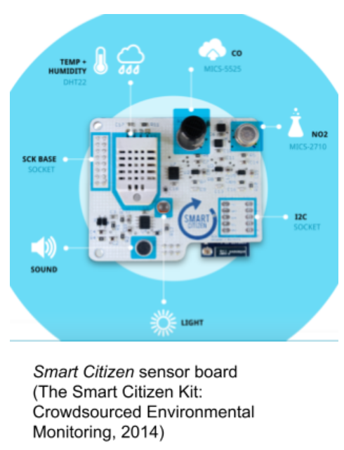

# e-waste-sensing
Repository for e-waste sensor build

## Abstract

Environmental sensing is an essential part of ecology and sustainable agriculture. However, sensors can be extremely expensive and difficult for non-vocational "citizen scientists" to obtain. In a world of post-scarcity, technological waste is all around us. When a gadget breaks, it is often easier and cheaper to throw it away and purchase a new one than to attempt to repair it. Citizen scientists can take advantage of this unfortunate by-product of "throw away culture" by harvesting the sensor technology that is often found in e-waste. This paper discusses an approach to the development of such sensors. We begin with a brief overview of environmental monitoring with a specific focus on projects that encourage the participation of non-vocational contributors (i.e. “citizen scientists”), and the problem of e-waste as a motivation  to the novel approach of our design. We then discuss the process of design and development of three important environmental sensors -- a light meter, a thermometer and a moisture sensor -- from commonplace materials often found in discarded e-waste. This includes an extensive investigation and explanation of the configuration / calibration of our make-shift sensors to achieve acceptable results as well as an analysis of the precision and accuracy of each sensor. Finally, a complete account of a “demonstrator build” is provided followed by a reflection on the project including challenges in the process and recommendations for future research is given. 

## Background

When assessing and addressing environmental issues, especially at a local level, it is more advantageous to involve non-vocational community members -- those who are directly affected by such issues -- than those who are “scientists” and “academics” by trade. Such an approach has been found to be both faster and more efficient as dedication amongst local-level agents has been found to be much higher than those with little attachment or “stake” in the success of the project (Danielsen and Burgess et al., 2010, pp. 1166--1168).  However, oftentimes there is very little funding and resources available to non-vocational “citizen scientists” and thus necessitates support from non-local institutes. 

There a number of projects already in existence that purport to address exactly this issue -- and they are here-in detailed along with their advantages and their disadvantages to frame justification for an “upcycled sensor development” approach. It should noted, as we traverse this “technological landscape” of “citizen sensing”, that while the economic climate is constantly shifting towards affordability, mass distribution of these sort of devices (in “detector arrays”, for example) is still quite out of the scope of many budgets. 
 
Before reviewing individual projects, however, it may be prudent to briefly describe what researchers in citizen science call “the typology of participation”. According to Sui and Elwood in “Crowdsourcing Geographic Knowledge”, there exists four levels of participation in citizen science activities. 

Sui and Elwood identify 4 different levels of involvement of citizen scientists. These range from passive distribution of computing / sensing / funding (i.e. ‘crowdsourcing’) to direct collaboration and engagement with the scientific process. The majority of the projects outlined here fall  within the first two levels of engagement -- however, this should not be interpreted as an inability for citizen scientists to participate in environmental sensing projects at higher levels.  While there are many ecological sensing projects worthy of examination, to list them all would be well outside the scope of this paper -- therefore only a select few are outlined here. It should also be noted that, while there exists a large number of commercial sensors already on the market, this paper does not regard them for a number of reasons. The most obvious reason being cost. The most important reason, however, being that the “closed” nature of these devices does not possibly allow for them to be reconstructed using recycled materials, thus completely negating the second premise of this research (which will be later detailed).

#### Smart Citizen (http://www.smartcitizen.me/)

One of the most polished option for citizen scientist environmental sensing is the “Smart Citizen” project. The “Smart Citizen Kit” is billed as “an Open-Source Environmental Monitoring Platform consisting of arduino-compatible hardware, data visualization web API, and mobile app” (Smart Citizen, 2014). It is the result of a crowdfunding effort on Kickstarter by Fab Lab Barcelona at the Institute for Advanced Architecture of Catalonia. The sensor board can measure air composition (CO and NO2), temperature, light intensity, sound levels, and humidity and is capable of communicating data wirelessly to iOS devices via the Smart Citizen App. The kit itself consists of three boards -- the “ambient board” which houses the sensors, a data-processing board based on an ATMega32u4, and a “Baseboard” with USB socket, SD-card reader, EEPROM, battery holder and clock (The Smart Citizen Kit: Crowdsourced Environmental Monitoring, 2014). The Smart Citizen Kit places a particular emphasis on large-scale collaboration. Users can register their sensor board on the Smart Citizen website and communicate their local conditions over the web. The result is an international “sensornet” that is openly available for anyone to make use of  (Smart Citizen, 2014). There are a number of shortcomings with the Smart Citizen, however. First, the price-tag. The price for a fully-assembled Smart Citizen Kit from the Smart Citizen e-store is $175 (http://www.smartcitizen.me/pages/store). While this may not seem to be an outstanding amount compared to most “professional” sensing equipment, it is certainly not scalable on a local level (e.g. for a 100-node agricultural sensing network in a farmer’s field) -- and does not yet include sensors to monitor soil conditions such as moisture / conductivity. This sensor would be considered a level one or two on the “involvement scale” as, currently, it affords citizens the role of data collector and reporter only. 

#### GardenBot (gardenbot.org)

According to the gardenbot.org website, GardenBot “is an open source garden monitoring system” (Frueh, 2014). However, GardenBot is more than just a ‘garden monitoring system’; it is a comprehensive how-to on small-scale environmental monitoring.  The “bot” itself is composed of an Arduino Uno as the “brain”, an LM335 temperature sensor, a small photocell (for monitoring light) and a moisture sensor made of galvanized wire. Furthermore, the system incorporates a “water valve” as the control for an automated watering system that responds to soil moisture levels. The system, despite being quite simple, has been featured on wired.com, treehugger.com, OpenSourceEcology and SparkFun.com (Frueh, 2014). 

There are, however, a number of notable drawbacks to this system. Most notably is the fact that it must be connected to a PC. The system works on PC-Arduino serial communication -- and therefore requires a dedicated PC to run and thus does not allow for the sort of portability that one might hope from an environmental monitoring system. Moreover, because the system incorporates an Arduino board and a number of other components that must be purchased, the set-up is not particularly scalable on a tight budget. Given the rather involved nature of constructing the device -- there is no option to order it pre-assembled -- any citizen scientist working with this device must have a fair bit of aptitude -- and thus would rise above the ordinary 1st and possibly 2nd level of engagement to “participatory science” -- at least for the principal stages.

#### Growerbot (formerly garduino -- growerbot.com)

The “Growerbot”, another Arduino-based garden monitor, is billed as a “gamified gardening assistant” (although it seems unclear from the growerbot website exactly how it is “gamified”). The Growerbot is equipped with a “soil probe”, a temperature / humidity sensor, and TSL2561 luminosity sensor. It is also wifi-enabled with an “Electric Imp” connectivity platform for connecting to the “internet of things” and thus giving the Growerbot the capacity to share data both locally and over the web. The standard kit also contains an LCD interface and a light / pump controller. The final system is a handsome and well-polished device. However, once again, one kit alone costs nearly $195 fully assembled. (Iseman, 2013) Citizen Scientists using the Growerbot easily have the affordances to operate at any level on the typological ladder of participation. Because the Growduino comes pre-assembled, one need not be concerned with the building process. However, because of the “electric imp” connectivity, the user has the capacity to volunteer as much information in whatever way they choose to the Electric Imp network -- thus allowing them to work in whatever capacity they see fit. 

### The Problem of E-Waste
A core research principle in the development of the system to be outlined here is the use of reclaimed components in electronic waste. The economic reasons are quite obvious. Harvesting components from e-waste costs only the time of the harvester -- however, there are also ecological considerations to account for. 

In 2012 alone, the average Canadian generated 24.72 kg of electronic waste. This is a staggering fact given that the average Canadian consumed 28.59 kg of electronic products that same year. (STEP, 2014) In a year dispose of 86% of the electronics we purchase. Many of these items, if not disposed of properly, pose very real environmental and health hazards. Cathode ray tubes, for example, are known to leach heavy metals such as lead into groundwater. Gold plated components such as IC’s discharge hydrocarbons and bromide into water-bodies turning them acidic and killing fish. Plastics from electronics housings emit dioxins and hydrocarbons (Wath, Dutt and Chakrabarti, 2011). In industrialized countries, these problems are well-managed with recycling and reclamation programs. However, a good deal of electronic waste is instead exported to developing countries where there is little infrastructure to deal with it. The result is unfortunate in that the peoples of these nations are often forced to live alongside this hazardous waste (Grossman, 2006). 

The irony of producing e-waste to develop environmental sensors is not lost on the researcher and it is, therefore, the philosophy of this project --so much as possible -- that no new materials should be produced to develop it. 

### Environmental Sensor Development

The intended final application of this project is an agricultural sensor grid spaced throughout a local crop-field. To begin with, three important growing variables for most crops are considered -- the amount of light received, the local temperature and the local soil-moisture (i.e. conductivity). Therefore, three separate sensors must be developed -- a light-meter, a thermometer and a conductivity sensor. 

#### Light Meter
A new light meter is priced at around $6 (Adafruit Industries, 2014). While this is perfectly sensible for a single meter, scaling into the hundreds is not feasible. However, electronic waste is rife with photoresistors which can be used as rudimentary luminosity  sensors. However, a reading from a photoresistor will not be in the standard measurement of light (lumens) -- and we therefore must calibrate any photoresistor that we use for this purpose. Calibration can be accomplished by measuring the voltage across a photoresistor as a light source provides different levels of light -- and then compared to a calibrated light meter. Because lab-grade light-meters are not particularly readily available, a simple solution is to use the light-meter that most smart-phone devices are now endowed with. Using a three-level desk lamp as a light source and Sensor Logger by i-RealitySoft on a Samsung Galaxy Note 2 smart-phone, a simple photoresistor circuit (see appendix A) was calibrated to respond with acceptable accuracy. To do so, the average luminosity was plotted against the reading from our photoresistor and a near-linear relationship of lux = 5.3*
(lx/(unit/3v))*
(resistor)-
2401.5 lx 
was found with an R^2 of 0.97. 

#### Temperature Sensor
The MSP430G2553 microcontroller unit which serves as the “brain” of this project contains an internal temperature sensor that can be easily read via either a serial connection or an attached display. These chips are very common both in industrial applications and in commercial ones such as children’s toys. (Four-Three-Oh!, 2012) Before attempting to utilize the internal temperature sensor “in production”, however, an exact idea of how accurate it is must be determined. 

The procedure for cross-checking the temperature was simple -- a digital house thermometer was placed next to the MSP430 Launchpad Development board (which was in-turn connected via serial-over-USB to a computer where the temperature was read out. Randomly over a week the temperatures read by both devices was recorded and compared. 
The results were quite acceptable. Over 30 samples recorded during the week, the average percent error was approximately 2.4%. Although this is certainly not lab-quality scientific accuracy, as a makeshift environmental sensor, this small bit of seemingly systematic error is quite acceptable. 

#### Soil Moisture Sensor
To determine the moisture of soil, a pair of galvanized nails are soldered to a pair of wires with one lead connected to +3V and the other connected to a 10K pull-down resistor and to an analog input on the MSP430. The simple idea behind this set-up is that as moisture is added to the soil it becomes more conductive and thus there becomes less and less resistance between the sensor nail and the voltage source nail. To test this a sample of ¾ cup of potting soil was placed in a cup with the nails spaced a few centimeters apart and water was added in ⅛ cup increments until the soil was completely saturated with water. The values were recorded over the serial port and plotted to examine what constitutes “under watering” and “over watering”. It was found that in completely dry soil, the reading is nearly zero. Once the first ⅛ cup of water is added, that value changes quickly to be around 600. Another ⅛ cup brings the value up to a little over 650, and it appears to max out at around 700 -- whereby the soil is completely saturated with water. 

### Demonstrator Build
With the sensors (mostly) working, a final build to enclose the sensors was constructed. The components were removed from the breadboard and soldered directly to a small prototyping PCB. A recycled pill-bottle was chosen as a housing -- and a 3V coin-cell battery installed. Holes for the moisture sensor probes and the light sensor were drilled on the bottom and top, respectively. Hot-glue served to water-tighten the ports for the sensors. While it is yet to be tested, the final build is meant to be water-tight and weather worthy with the ability to survive an entire season in a field or garden.  After such a time, the capsule can be extracted and the chip removed from the device. The data periodically stored to the non-volatile flash memory within the MSP430 can then be collected and interpreted. (See Appendix A for complete schematic) It is intended that the final product will fall within the “first level” of citizen science involvement, allowing volunteers to passively collect data (literally burying the equipment in the ground and forgetting about it) without needing to concern themselves with the broader work. 

### Reflective Project Summary / Future Work
Over-all, the development process for this project was fraught with unexpected challenges -- however, half of the original milestones of the original project proposal were met. A simple working sensor-system based off of the MSP430 was developed and was able to successfully write values out via serial for analysis, and the accuracy of those sensors were explored and calibrated through statistical analysis. However, the goal to include wireless connectivity and to add additional sensors was not met. A self-contained circuit build was constructed, although as of yet the device is not capable of storing data to non-volatile memory for reclamation at a later time. It is anticipated that this will be a simple fix when time does allow. 

The largest set-back to the project was, for quite some time, the inability to retrieve data via the serial port. It is a standard issue with the MSP430 Launchpad (the “programmer”) to “flood” the serial port, thus sporadically freezing it up. It was the naive assumption of the researcher that the problem was to do with the actual circuit design, however, a fix was eventually found (see Appendix B) -- but not without major delay to the final project. 

This project has been only a small preliminary step towards a much larger research project which includes building hundreds of these sensors to form “sensor networks” that can autonomously record data for an entire environmental region (e.g. a field or garden). Furthermore, it is intended that some sort of long-range wireless communication be included in a future build in order to retrieve the data without the hassle of digging the capsules up and taking them apart -- thus allowing for data to be collected for analysis on a more frequent basis. All of this, of course, will be after the current issue of storing data to non-volatile memory is sorted out. 

### Summary
In this paper, a sensor system constructed entirely of electronic waste was proposed as a solution to the problem of mass sensing by organizations and individuals with very little in the way of budget -- especially citizen scientists. A brief overview of the concept of “Levels of Citizen Science” was explained in order to frame each of the projects described here. Three different projects were briefly discussed and both their pros and cons considered. Justification for using only recycled materials for the final sensing system was given in an ecological context as a response to “the problem of e-waste”. The development of the sensor system was then discussed and the validation and calibration of the sensors was detailed at length along with the statistical analysis involved for each sensor. The final build was then revealed and a reflection on the build process provided including a discussion on the challenges that this project faced and the future direction of this research. 

### Conclusion
To re-iterate, environmental sensing is an essential part of ecology and agriculture -- now, more than ever. As we as a species endeavor to conquer some of the most difficult trials and challenges we have ever faced-- climate change, overpopulation, food shortages and general ecological distress -- it is vital that the “common” man embrace the idea that they too can contribute to securing our future. Let us provide them with the tools. 

### References			
Adafruit Industries. 2014. [online] Adafruit.com. Available at: <http://www.adafruit.com/search?q=light+sensor> [Accessed 17 Apr. 2014].
			
Danielsen, F., Burgess, N., Jensen, P. and Pirhofer-Walzl, K., 2010. Environmental monitoring: the scale and speed of implementation varies according to the degree of peoples involvement. Journal of Applied Ecology, 47(6), pp.1166--1168.
			
Four-Three-Oh!. 2012. [online] 43oh.com. Available at: <http://43oh.com/2012/03/winner-products-using-the-msp430/> [Accessed 17 Apr. 2014].
			
Frueh, A., 2014. GardenBot - open source garden automation project. [online] Gardenbot.org. Available at: <http://gardenbot.org/about/> [Accessed 17 Apr. 2014].
			
Ganapati, P., 2010. GardenBot Brings Geek Power to Green Thumbs | Gadget Lab | WIRED. [online] WIRED. Available at: <http://www.wired.com/2010/08/gardenbot-gardening/> [Accessed 17 Apr. 2014].
			
Grossman, E., 2006. Where computers go to die — and kill. [online] Salon.com. Available at: <http://www.salon.com/2006/04/10/ewaste/> [Accessed 17 Apr. 2014].
			
Iseman, L., 2013. Blog | growerbot. [online] Growerbot.com. Available at: <http://www.growerbot.com/blog/> [Accessed 17 Apr. 2014].
			
Smart Citizen. 2014. [online] Smartcitizen.me. Available at: <http://www.smartcitizen.me> [Accessed 17 Apr. 2014].
			
StEP E-waste World Map - Overview Canada - STEP. 2014. [online] Step-initiative.org. Available at: <http://step-initiative.org/index.php/Overview_Canada.html> [Accessed 17 Apr. 2014].
			
Sui, D. and Elwood, S., 2013. Crowdsourcing geographic knowledge. 1st ed. Dordrecht [etc.]: Springer.
			
The Smart Citizen Kit: Crowdsourced Environmental Monitoring. 2014. [online] Kickstarter. Available at: <https://www.kickstarter.com/projects/acrobotic/the-smart-citizen-kit-crowdsourced-environmental-m> [Accessed 17 Apr. 2014].
			
Wath, S., Dutt, P. and Chakrabarti, T., 2011. E-waste scenario in India, its management and implications. Environmental monitoring and assessment, 172(1-4), pp.249--262.
